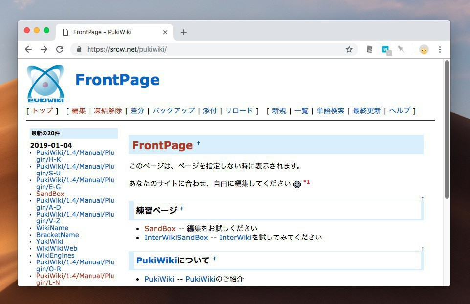

Simple Responsive Skin for PukiWiki
===================================

**2022/04/12(火)追記はじまり**

PukiWiki 1.5.4はレスポンシブに対応しました。このテーマを適用する必要はありません。
表示幅の制限を行いたい場合、1.5.4に含まれるpukiwiki.cssに以下を追加します。
```
@media (max-width:10000px) {
   body
   {
       max-width: 1000px;
   }
}
```
**2022/04/12(火)追記おわり**


PukiWiki 1.5.3対応のシンプルなレスポンシブスキンです。





[デモサイト](https://srcw.net/pukiwiki/)で動作が確認できます。[src256 wiki](https://srcw.net/wiki)では少しカスタマイズしたバージョンが動いています。

作成にあたり[PukiwikiレスポンシブSkin](http://reddog.s35.xrea.com/wiki/Pukiwiki%E3%83%AC%E3%82%B9%E3%83%9D%E3%83%B3%E3%82%B7%E3%83%96Skin.html)を参考にさせていただきました。

## 実行環境

- PukiWiki 1.5.3

## インストール方法

- GitHubからダウンロードします。
```
$ git clone https://github.com/src256/sr.git
```
- srディレクトリをPukiWikiのskinディレクトリ以下にコピーします。
```
$ cp -a sr ~/public_html/wiki/skin
```
- default.ini.phpを編集しsr.skin.phpを読み込みます。
```
define('SKIN_FILE', DATA_HOME . SKIN_DIR . '/sr/sr.skin.php');
```
- 外見をカスタマイズする場合srディレクトリ内にsr-custom.cssを作成します。


## ライセンス

[MIT](https://github.com/tcnksm/tool/blob/master/LICENCE)
